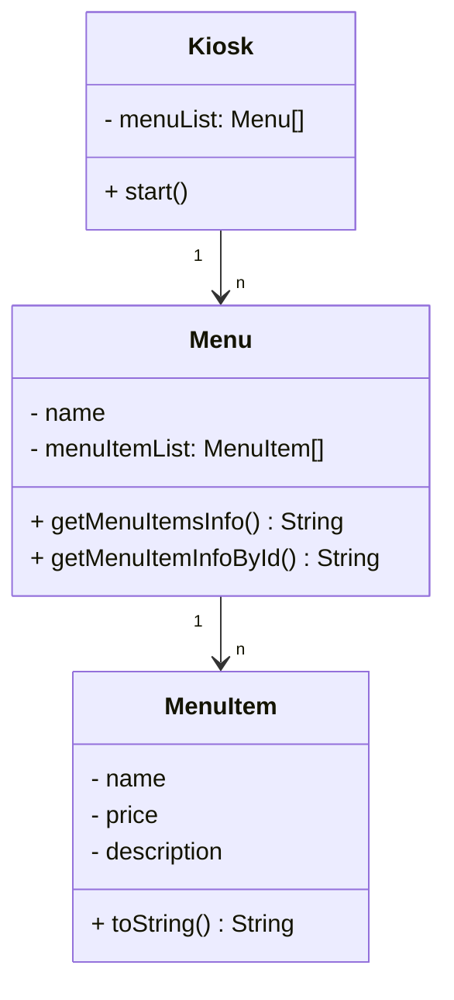

# 객체지향 Kiosk

콘솔 인터페이스로 사용자에게 음식 메뉴 정보를 제공하는 서비스를 구현하는 과제가 있었다.

요구사항을 요약해보면 아래와 같다.

- 업무 요구사항
  - [x] 사용자는 콘솔에서 메뉴를 확인하고 선택할 수 있다.
  - [x] 입력은 0부터 시작해 증가하는 숫자로만 받는다.

- 기술 요구사항

  - [x] lv1:
    - 시작점이 되는 main함수를 가진 클래스는 `Main`으로 하라
  - [x] lv2:
    - 메뉴아이템은 이름, 가격, 설명 값을 가진 `MenuItem` 클래스를 활용하라
    - 이 메뉴아이템을 관리하는 List를 선언한다.
  - [x] lv3: 
    - 사용자의 입력을 처리하는 `Kiosk`클래스를 만들어라.
    - `List<MenuItem> menuItems`는 Kiosk 클래스 생성자를 통해 값을 할당한다.
    - main 함수에서 관리하던 입력과 반복문 로직은 이제 `start` 함수를 만들어 관리한다.
  - [x] lv4:
    - `List<MenuItem> menuItems`를 갖는 `Menu` 클래스를 만들어라
    - `Kiosk`는 `List<Menu> menuList`를 갖는다.

<br/>

## 목차

- [고민 과정](#고민-과정)
  - [다이어그램 구조](#다이어그램-구조)
- [마치며](#마치며)


<br/>

## 고민 과정

### 다이어그램 구조

각 클래스간의 관계를 어느정도 그려보았다. MenuItem이 n개일때 Menu는 1개이고, Menu가 n개일 때, Kiosk는 1개이다.


<div align="center"></div>


A → B를 'A가 B를 의존한다' 라고 하면, 일반적인 엔티티 관계에서는 아래의 구조를 세운다.

<div align="center"></div>


그래서 처음에 당연히 위와 같이 코드를 작성해나갔는데, 요구사항을 보니 아래의 구조로 설계를 하라고 한다.

<div align="center"></div>

우선 요구사항대로 이렇게 한 후에 추가 고민한 글에 대해서 적어보려 한다. 아래는 최종 클래스 다이어그램이다.



(24.11.27 추가된 내용) 튜터님에게 여쭤본 내용을 짧게 정리해보려 한다.

1. DB의 경우 N이 foreign key로 1을 향하도록 하는게 맞으며, 만약 양방향 참조로 엔티티를 구성할 경우 n + 1 문제가 생긴다.
2. 현재 상황은 DB로부터 조회한다는 가정 없이, 객체지향 프로그래밍을 연습하기 위한 과제이다.
3. Repository를 따로 만들어 관리하도록 하게 할 수는 있지만, 특정 Menu에 대한 MenuItem을 조회한다고 했을떄 전부 다 조회해서 필터링 해야한다. 시간 복잡도 측면에서 비효율적이다.

정말 개발한다면 이 메뉴는 실행될때 생성되는 것이 아니라, 정 DB로부터 조회한다거나 할 것이다. 그런다면 n이 1을 바라보도록 할 것이다.

우선 런타임에 사용자로부터 입력받아서 데이터가 추가되는 것들은 지금처럼 1이 N을 리스트로 관리하는 게 맞다고 생각이 들었다.

어느정도 기준을 세울 수 있었던 것 같다.

<br/>

### 가변인자

Kiosk 클래스 생성자를 통해 List에 있는 값을 할당한다는 부분에서 고민을 했는데, 가변인자가 생각 났다.

```java
public class Kiosk {
  List<Menu> menuList;

  public Kiosk(Menu ...menu) {
    menuList = List.of(menu);
  }
}
```

이런 식으로 하니 아래와 같이 여러 인자를 넣을 수 있었다.

```java
Kiosk kiosk = new Kiosk(Burgers, Drinks, Desserts);
```

굳이 배열을 생성해서 복사한다거나, 컬렉션을 전달한다거나 하는 것보다 훨씬 깔끔해진다.


<br/>


## 마치며

지금은 단순히 메뉴를 집어 넣고 조회하는 기능밖에 없어서, 흠.. 문제해결과정이랄게 딱히 없었다.

(24.11.27) DB에 대해서 더 깊게 파야된다고 느꼈다. 그리고, 객체지향... 설계가 무한하게도 나온다고 생각했다. 이건 당분간 그만 파고, 기술적인 것에 집중해서 학습을 하자.

